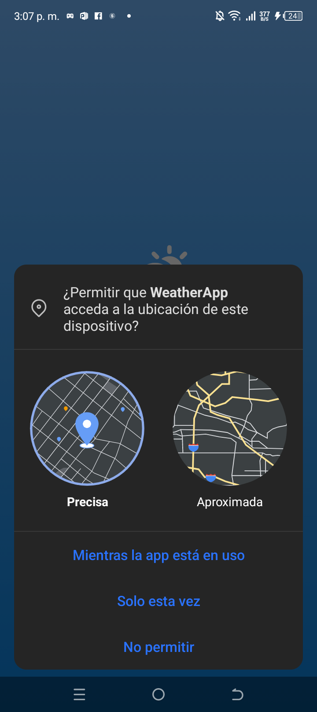

# 🌤️ Weather App

Una aplicación móvil moderna de pronóstico del clima desarrollada con React Native y Expo. Obtén información meteorológica en tiempo real basada en tu ubicación actual con una interfaz intuitiva y elegante.

## ✨ Características

- **🌍 Geolocalización automática**: Detecta tu ubicación actual para mostrar el clima local
- **🌡️ Clima en tiempo real**: Temperatura, humedad, presión atmosférica y más
- **📅 Pronóstico de 5 días**: Planifica tu semana con predicciones detalladas
- **🎨 Interfaz adaptativa**: Colores de fondo que cambian según las condiciones climáticas
- **🔄 Actualización manual**: Pull-to-refresh para obtener datos actualizados
- **📱 Multiplataforma**: Compatible con iOS, Android y Web
- **🌓 Modo claro/oscuro**: Soporte automático para temas del sistema

## 🚀 Tecnologías utilizadas

- **[Expo](https://expo.dev)** - Framework de desarrollo
- **[React Native](https://reactnative.dev)** - Framework móvil
- **[TypeScript](https://www.typescriptlang.org)** - Tipado estático
- **[Expo Router](https://docs.expo.dev/router/introduction/)** - Navegación basada en archivos
- **[Expo Location](https://docs.expo.dev/versions/latest/sdk/location/)** - Servicios de geolocalización
- **[Expo Linear Gradient](https://docs.expo.dev/versions/latest/sdk/linear-gradient/)** - Gradientes para UI

## 📋 Requisitos previos

- **Node.js** (versión 18 o superior)
- **npm** o **yarn**
- **Expo CLI** (opcional, pero recomendado)
- Dispositivo móvil con **Expo Go** o emulador configurado

## 🛠️ Instalación y configuración

### 1. Clonar el repositorio

```bash
git clone https://github.com/tu-usuario/weather-app.git
cd weather-app
```

### 2. Instalar dependencias

```bash
npm install
```

### 3. Configurar API Key

Crea un archivo `.env` en la raíz del proyecto:

```env
EXPO_PUBLIC_WEATHER_API_KEY=tu_api_key_aqui
EXPO_PUBLIC_WEATHER_API_URL=https://api.openweathermap.org/data/2.5
```

> **Nota**: Necesitarás una API key gratuita de [OpenWeatherMap](https://openweathermap.org/api)

### 4. Iniciar el servidor de desarrollo

```bash
npx expo start
```

## 📱 Ejecución en dispositivos

### Dispositivo físico
1. Descarga **Expo Go** desde la App Store o Google Play
2. Escanea el código QR que aparece en la terminal
3. La aplicación se cargará automáticamente

### Emulador iOS
```bash
npx expo start --ios
```

### Emulador Android
```bash
npx expo start --android
```

### Navegador web
```bash
npx expo start --web
```

## 📱 Pantallas de la aplicación

### 🏠 Pantalla Principal (`app/(tabs)/index.tsx`)

- **Bienvenida**: Mensaje de bienvenida con animación de saludo
- **Guía paso a paso**: 
  - Paso 1: Instrucciones para editar y ver cambios
  - Paso 2: Enlace a exploración con menú contextual avanzado
  - Paso 3: Guía para obtener un proyecto limpio
- **Navegación**: Acceso rápido a otras secciones

### 🔍 Pantalla Explorar (`app/(tabs)/explore.tsx`)
- **Documentación interactiva**: Secciones colapsables con información
- **Temas incluidos**:
  - File-based routing (enrutamiento basado en archivos)
  - Soporte multiplataforma (Android, iOS, Web)
  - Manejo de imágenes con densidades múltiples
  - Componentes de modo claro/oscuro
  - Animaciones con react-native-reanimated
- **Enlaces externos**: Recursos de aprendizaje de Expo

### 🌤️ Pantalla Principal del Clima (`app/_layout.tsx`)
- **Clima en tiempo real**: Tarjeta con datos meteorológicos actuales
- **Pronóstico extendido**: Vista de 5 días con tarjetas individuales
- **Geolocalización**: Detección automática de ubicación
- **Actualización**: Pull-to-refresh para datos actualizados
- **Fondo dinámico**: Gradientes que cambian según el clima

### 📋 Pantalla Modal (`app/modal.tsx`)
- **Modal de ejemplo**: Demostración de navegación modal
- **Navegación**: Botón para regresar a la pantalla principal

## 📁 Estructura del proyecto

```
weather-app/
├── app/                      # Rutas de la aplicación
│   ├── (tabs)/              # Navegación por pestañas
│   │   ├── index.tsx        # 🏠 Pantalla de bienvenida y guía
│   │   ├── explore.tsx      # 🔍 Documentación interactiva
│   │   └── _layout.tsx      # 📱 Layout de pestañas
│   ├── _layout.tsx          # 🌤️ Pantalla principal del clima
│   └── modal.tsx            # 📋 Ejemplo de modal
├── components/              # Componentes reutilizables
│   ├── WeatherCard.tsx      # Tarjeta de clima actual
│   ├── ForecastCard.tsx     # Tarjeta de pronóstico
│   ├── LoadingScreen.tsx    # Pantalla de carga
│   ├── hello-wave.tsx       # Animación de saludo
│   ├── parallax-scroll-view.tsx # Vista con efecto parallax
│   ├── themed-text.tsx      # Texto con temas
│   ├── themed-view.tsx      # Vista con temas
│   ├── haptic-tab.tsx       # Pestañas con retroalimentación háptica
│   └── ui/                  # Componentes de UI base
│       ├── icon-symbol.tsx  # Iconos del sistema
│       └── collapsible.tsx  # Componente colapsable
├── services/                # Servicios de API
│   └── weatherAPI.ts        # Cliente de API del clima
├── types/                   # Definiciones de TypeScript
│   └── weather.ts           # Tipos relacionados al clima
├── constants/               # Constantes de la app
│   └── theme.ts             # Colores, tipografías y temas
├── hooks/                   # Hooks personalizados
│   └── use-color-scheme.ts  # Hook para detección de tema
└── assets/                  # Recursos estáticos
    └── images/              # Imágenes y iconos
        ├── react-logo.png
        └── partial-react-logo.png
```

## 🌡️ Servicios de clima

La aplicación utiliza la API de OpenWeatherMap para obtener:

- **Clima actual**: Temperatura, descripción, humedad, presión
- **Pronóstico extendido**: Predicciones para los próximos 5 días
- **Datos de ubicación**: Nombre de ciudad y país

## 🎨 Temas dinámicos

Los colores de fondo cambian automáticamente según las condiciones climáticas:

- **☀️ Soleado**: Gradientes dorados y naranjas
- **🌧️ Lluvioso**: Tonos grises y azules oscuros
- **❄️ Nieve**: Colores blancos y grises claros
- **☁️ Nublado**: Verdes y azules suaves

## 🔐 Permisos requeridos

- **Ubicación**: Para obtener coordenadas y mostrar clima local
- **Red**: Para realizar peticiones a la API del clima

## 🚧 Desarrollo

### Comandos útiles

```bash
# Iniciar en modo desarrollo
npm start

# Limpiar caché de Expo
npx expo start --clear

# Generar build de producción
npx expo build

# Resetear proyecto (eliminar código de ejemplo)
npm run reset-project

# Ejecutar linter
npm run lint

# Ejecutar tests
npm test
```

### Estructura de datos

```typescript
interface WeatherData {
  main: {
    temp: number;
    humidity: number;
    pressure: number;
  };
  weather: [{
    main: string;
    description: string;
    icon: string;
  }];
  name: string;
  sys: {
    country: string;
  };
}
```

## 🐛 Solución de problemas

### Error de ubicación
- Verifica que los permisos de ubicación estén habilitados
- Asegúrate de que el GPS esté activado en el dispositivo

### API Key inválida
- Confirma que la API key esté correctamente configurada en `.env`
- Verifica que la key esté activa en OpenWeatherMap

### Problemas de build
```bash
# Limpiar node_modules y reinstalar
rm -rf node_modules
npm install

# Limpiar caché de Expo
npx expo start --clear
```

## 🤝 Contribuir

1. Haz fork del proyecto
2. Crea una rama para tu feature (`git checkout -b feature/nueva-funcionalidad`)
3. Commit tus cambios (`git commit -m 'Agregar nueva funcionalidad'`)
4. Push a la rama (`git push origin feature/nueva-funcionalidad`)
5. Abre un Pull Request

## 📄 Licencia

Este proyecto está bajo la licencia MIT. Ver el archivo [LICENSE](LICENSE) para más detalles.

## 👏 Agradecimientos

- [OpenWeatherMap](https://openweathermap.org) por la API del clima
- [Expo](https://expo.dev) por el framework de desarrollo
- Comunidad de React Native por el soporte continuo

## 📞 Soporte

Si tienes alguna pregunta o problema:

- 📧 Email: tu-email@ejemplo.com
- 💬 Discord: [Comunidad Expo](https://chat.expo.dev)
- 🐛 Issues: [GitHub Issues](https://github.com/tu-usuario/weather-app/issues)

---

⭐ Si te gusta este proyecto, ¡no olvides darle una estrella!